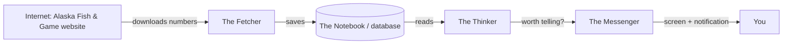

# Build It Yourself — The Salmon Tracker App

A friendly, start-from-zero guide to understanding, building, and changing this app.
Written so a curious beginner (even a kid who has never made an app before) could
take it over and keep going. No prior Android experience required — just patience
and curiosity.

---

## 1. What is this app, in one breath?

Alaska counts how many salmon swim up certain rivers each day. The state posts
those numbers on a public website. This app **checks that website for you**, keeps
a copy of the numbers on your phone, draws a little chart, and **buzzes you with a
notification when new numbers show up** — so you don't have to keep refreshing a
webpage yourself.

That's it. Everything else in the code exists to make that one job reliable,
battery-friendly, and pleasant to look at.

---

## 2. The 60-second mental model

Think of the app as four helpers working together:

1. **The Fetcher** — goes to the internet, downloads the latest fish numbers.
2. **The Notebook** — a tiny database on the phone that remembers every number.
3. **The Thinker** — decides "is this actually new and worth telling you about?"
4. **The Messenger** — draws the screen and sends notifications.



If you remember only this picture, the rest of the code will make sense.

---

## 3. Words you'll see everywhere (mini dictionary)

Keep this handy. You don't need to memorize it — just glance back when a word looks scary.

- **Android** — the operating system that runs on most non-Apple phones.
- **Java** — the programming language this app is written in. It's wordy but readable.
- **Gradle** — the "robot builder." You give it a command and it turns the code into
  an installable app. You'll type `./gradlew ...` a lot.
- **SDK** (Software Development Kit) — the giant toolbox Android gives developers.
- **APK** — the finished app file. Installing it puts the app on a phone.
- **Class** — a chunk of code that groups related stuff together. Each `.java` file
  is (mostly) one class. Think of it as a single "helper" with a name.
- **Method** — a single action a class can do, like `syncProject(...)`. Think "verb."
- **Database / Room** — the phone's little notebook. "Room" is the library that makes
  saving and reading rows easy.
- **WorkManager** — Android's "set a reminder to run this later, even if the app is
  closed" system. We use it for the background checks.
- **Notification** — the banner/sound that pops up on your phone.
- **Deep link** — a special web-style link that opens the app straight to something.
- **Quiet hours** — a time window (default 10pm–7am) when we hold notifications so
  you don't get buzzed while sleeping.

---

## 4. Set up your workshop (one time)

You need three things installed. On a normal computer, the easy path is:

1. **Android Studio** — the free official program for making Android apps. Download it
   from Google. It bundles most of what you need (the SDK, an emulator, and a code
   editor). Install it and let it download the "Android SDK Platform 36."
2. **JDK 17** (Java Development Kit, version 17) — Android Studio usually includes a
   compatible Java, so you may not need a separate install.
3. **This project's folder** — the code you're reading now.

> You do **not** need to buy anything. All the tools are free.

The very first time, Android Studio will "sync Gradle" (the robot builder gets ready).
That can take a few minutes. This is normal.

---

## 5. Build and run it

Two ways:

### The button way (easiest)
Open the folder in Android Studio, plug in an Android phone (with "USB debugging" on)
or start the built-in emulator, then press the green ▶ **Run** button.

### The command way (what a developer types)
From the project folder in a terminal:

```bash
# Build the app and run the automated tests:
./gradlew testDebugUnitTest assembleDebug
```

The finished app appears here:

```text
app/build/outputs/apk/debug/app-debug.apk
```

Copy that file to a phone and tap it to install (you may need to allow "install from
unknown sources").

> On this project's Linux setup, the build command also points Gradle at the SDK:
> ```bash
> ANDROID_SDK_ROOT=/home/jt/android-sdk ANDROID_HOME=/home/jt/android-sdk \
>   ./gradlew --no-daemon testDebugUnitTest assembleDebug
> ```
> On your own machine with Android Studio, you usually don't need those extra parts.

---

## 6. The map of the code

All the important files live in
`app/src/main/java/com/tripperdee/salmontracker/`. Here's every file and what it does,
in the order that makes them easiest to learn.

| File | Nickname | What it does |
|------|----------|--------------|
| `FishApplication.java` | The Startup | Runs once when the app first wakes up. Creates notification "channels" and schedules the background checks. |
| `FishRepository.java` | The Fetcher | Goes to the internet, downloads numbers, understands them, and saves them. The biggest, busiest file. |
| `AppDatabase.java` | The Notebook | Defines the phone's little database: what a "count record," a "sync state," and an "announcement" look like. |
| `FishLogic.java` | The Thinker | Pure decision-making: is this new? is it big enough to notify? is it fishing season? is it quiet hours? |
| `NotificationHelper.java` | The Messenger (alerts) | Turns "worth telling you" decisions into actual phone notifications. |
| `FishSyncWorker.java` | The Alarm Clock | The background job that runs every few hours to check for new numbers, even when the app is closed. |
| `MainActivity.java` | The Face | The whole screen you see: splash, numbers, chart, and the heat strip. Built entirely in code. |
| `SettingsActivity.java` | The Control Panel | The settings screen (turn notifications on/off, thresholds, test buttons, etc.). |
| `MuteReceiver.java` | The Mute Button | Handles the "mute this river" action from a notification. |

Test files (they check that the code works) live in
`app/src/test/java/com/tripperdee/salmontracker/`:
- `FishLogicTest.java` — checks the Thinker's decisions.
- `AdfgParserTest.java` — checks that the Fetcher reads the website correctly.

---

## 7. How the app actually works, step by step

### When you tap the icon
1. `MainActivity` shows a **splash screen** (the dark screen with the salmon) for a
   couple of seconds.
2. Then it builds the main screen and quietly **checks for new data** in the
   background (this is the "auto-check on open" feature).
3. It draws: the newest daily count, the season total, a trend chart, and the
   **Recent activity** heat strip (newest day on the left, scroll right for older).

### When it checks for new data (`FishRepository`)
1. Ask the website politely, using tricks that save data and battery (it only
   re-downloads if something actually changed).
2. If the site is having a bad day, a **"circuit breaker"** stops the app from
   nagging the server over and over. It waits and tries again later.
3. It reads the numbers two ways: the clean data feed first, and — if that format
   ever changes — a backup reader that scrapes the HTML table.
4. It **validates** the numbers (for example, a season total should never shrink).
   Bad or suspicious data gets rejected instead of trusted.
5. Good new numbers get written into **The Notebook** and an "announcement" is filed.

### When it decides whether to notify you (`FishLogic` + `NotificationHelper`)
1. Is there a fresh announcement? If not, stay quiet.
2. Is the change **meaningful**? Tiny wiggles are ignored (default thresholds:
   ~1,000+ fish or a 5%+ change). This stops spammy alerts.
3. Are notifications turned on and permitted?
4. Is it **quiet hours** (10pm–7am)? If yes, hold the alert and schedule a
   **catch-up** for just after 7am so you still find out promptly.
5. Otherwise: **send the notification.** One update = one banner; several at once get
   grouped into a tidy summary.

### The background checks (`FishSyncWorker`)
Even with the app closed, WorkManager wakes the app roughly every 6 hours to run the
same check. This is why you can get an alert without opening the app. (On some phones,
aggressive battery settings can delay these — opening the app is always the surest
way to force a fresh check.)

---

## 8. "I want to change something" — copy-paste recipes

These are safe first edits. After any change, re-run the build to make sure nothing broke.

### Change how long the splash screen shows
File: `MainActivity.java`. Look for `showSplash()` and the number `2200`. It's in
**milliseconds** (1000 = 1 second). Bigger number = longer splash.

### Add another river / fish project
File: `FishRepository.java`. Find the `PROJECTS` list where each `Project(...)` is
defined. Copy one line, give it a new `id`, `name`, and the matching location/species
numbers from the source site. (This is the trickiest recipe — the numbers must match
what the website uses.)

### Change what counts as a "big enough" change to notify
File: `FishLogic.java`, method `isMeaningful(...)`. The thresholds come from settings,
but the logic that compares them lives here.

### Change the colors
File: `app/src/main/res/values/colors.xml`. Edit the hex codes (like `#073447`).

### Change quiet hours default
Quiet hours are stored as settings (`quiet_start` / `quiet_end`). Defaults appear in
`NotificationHelper.java` (`prefs.getInt("quiet_start", 22)` → 22 means 10pm).

---

## 9. How to not break things (good habits)

- **Build after every change.** If it fails, read the first red error — it usually
  names the file and line. Fix that one, rebuild, repeat.
- **Run the tests.** `./gradlew testDebugUnitTest`. Green = the important logic still
  behaves. If you change the Thinker or the Fetcher, add or update a test.
- **Small steps.** Change one thing, build, check. Don't change ten things at once.
- **Save your work with git.** Each meaningful change becomes a "commit" with a short
  message describing it. That way you can always go back.

---

## 10. Keeping the app alive long-term (future-proofing)

The app depends on Alaska's public website. If they ever change how that page is
formatted, the Fetcher might need an update. Things that help:

- The **backup HTML reader** already covers some format changes automatically.
- The **parser tests** (`AdfgParserTest.java`) act like a smoke alarm — if the reading
  logic breaks, the tests go red so you notice.
- Keeping the tool versions (in the `build.gradle.kts` files) reasonably up to date
  prevents the toolbox from going stale.

---

## 11. Where to look when you're stuck

- **App won't build?** Read the first error line; it names the file. Often it's a
  missing semicolon `;` or a mismatched `{ }` bracket.
- **App builds but crashes?** In Android Studio, open the **Logcat** window — it prints
  what went wrong, usually with a line number in one of our files.
- **Notifications not showing?** Check: notifications turned on in settings, phone
  permission granted, not quiet hours, and the change was "meaningful."
- **Numbers look wrong?** Start in `FishRepository.java` (the Fetcher) and its tests.

---

## 12. A tiny challenge to prove you get it

Try this as your first real change:

1. Open `MainActivity.java`.
2. Find `showSplash()` and change `2200` to `3500`.
3. Build and run.
4. Watch the splash stay on screen longer.

If you did that, congratulations — you just edited, built, and ran a real Android app.
Everything else is the same idea, just bigger. Have fun. 🐟
